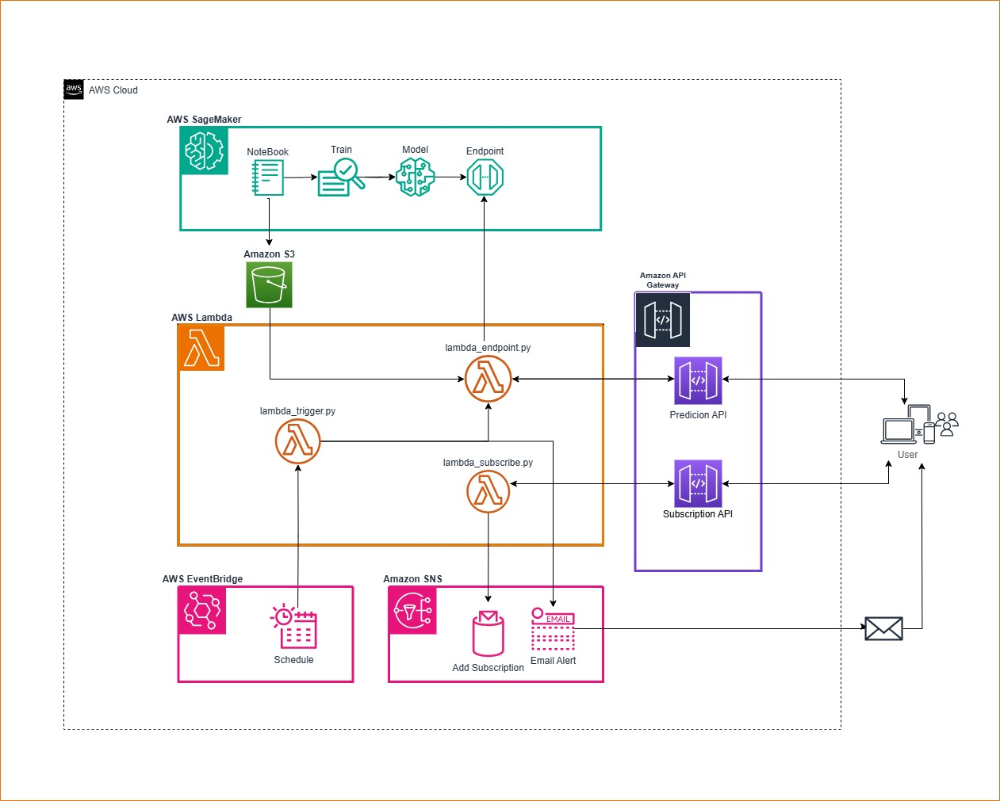
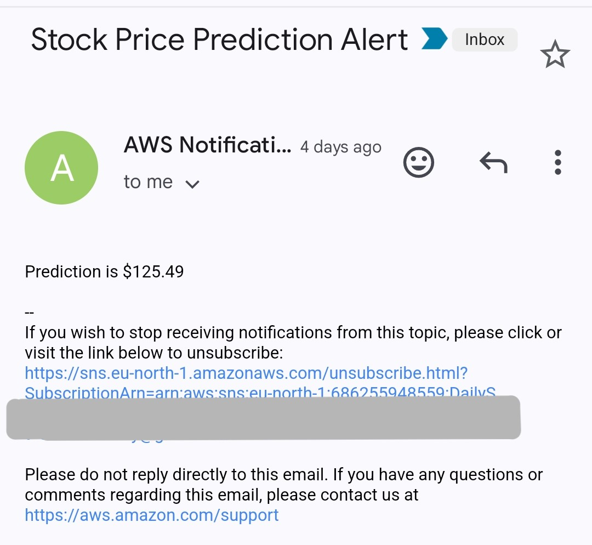

# Stock Price Prediction using AWS and XGBoost

This project predicts the next day's closing price of Apple (AAPL) stock using an XGBoost model trained on historical stock data from Yahoo Finance. The model is trained and deployed using AWS SageMaker, and real-time predictions are made using an endpoint. Additionally, users can subscribe to receive predictions via email using AWS SNS.

---

## Features

✅ Model: Optimized XGBoost for accurate stock price forecasting, feature engineering for improved prediction accuracy <br>
✅ Deployment: AWS SageMaker for scalable model training & hosting, integrated AWS S3 for data storage <br>
✅ Serverless API: API Gateway exposes a REST API that routes requests to Lambda to invoke the model endpoint or subscribe to SNS topic. <br>
✅ Notifications: SNS + Lambda for automated stock alerts for subscribers for receiving daily stock predictions triggered using AWS EventBridge <br>
✅ Frontend Testing: Developed a Streamlit interface to interactively test and visualize model predictions, allowing users to subscribe for stock alerts <br>

---

## Prerequisites  
To set up and run this project, you will need an AWS account with the following resources:  

- **Endpoint API URL** – Used to send stock data from the user to an AWS Lambda function, which retrieves predictions from the deployed model endpoint and returns them as a response.  
- **Subscription API URL** – Enables users to subscribe to daily stock prediction alerts via email by passing their email addresses to an AWS Lambda function.  
- **AWS SNS Topic ARN** – Required for managing email subscriptions and sending automated stock prediction notifications.  
- **Endpoint Lambda ARN** – Used to invoke the Lambda function via AWS EventBridge for automated stock price predictions.  

---

### **Step 2: Install Dependencies**
Install the required Python packages using `pip`:

```bash
pip install -r requirements.txt
```

---

## **Architecture**  

1. **Model Training in AWS SageMaker**  :
   - A **Jupyter Notebook** is used to develop and experiment with the model.  
   - The model is **trained** in AWS SageMaker.  
   - After training, the **model is saved** and deployed as an **endpoint** for inference.  

2. **Storing Model Data in Amazon S3**  :
   - The trained model and related artifacts are stored in **Amazon S3** for access by Lambda functions.  

3. **AWS Lambda for Inference & Subscription Handling**  :
   - `lambda_endpoint.py`:  
     - Receives **inputs** (stock data) from the API Gateway.  
     - Calculates features and invokes the **SageMaker endpoint** to get predictions.  
     - Returns the predicted **stock closing price** to the user.  
   - `lambda_subscribe.py`:  
     - Handles **subscription requests** from users who want daily prediction alerts.  
     - Adds users' email addresses to the **Amazon SNS topic**.  
   - `lambda_trigger.py`:  
     - Periodically invokes `lambda_endpoint.py` to generate daily stock predictions.  
     - Sends predictions via **Amazon SNS**.  

4. **API Exposure via Amazon API Gateway**  
   - **First API Gateway**:  
     - Accepts user requests with stock details and returns **real-time predictions** from `lambda_endpoint.py`.  
   - **Second API Gateway**:  
     - Allows users to **subscribe** to daily stock prediction emails by invoking `lambda_subscribe.py`.  

5. **Automated Scheduling using AWS EventBridge**  
   - **EventBridge** triggers `lambda_trigger.py` at scheduled intervals (daily) to run predictions automatically.  

6. **Amazon SNS for Email Notifications**  :
   - **Amazon SNS** sends **daily prediction emails** to subscribed users.  

7. **User Interaction** :
   - Users can request **real time prediction** via the Prediction API .  
   - Users can **subscribe via the Subscription API** to receive daily **email notifications** of stock predictions.  
8. **Front End Testing** :
   
.jpg)
.jpg)
.jpg)
9. **Email Alerts** :
<p align="center">
    
  </p>


